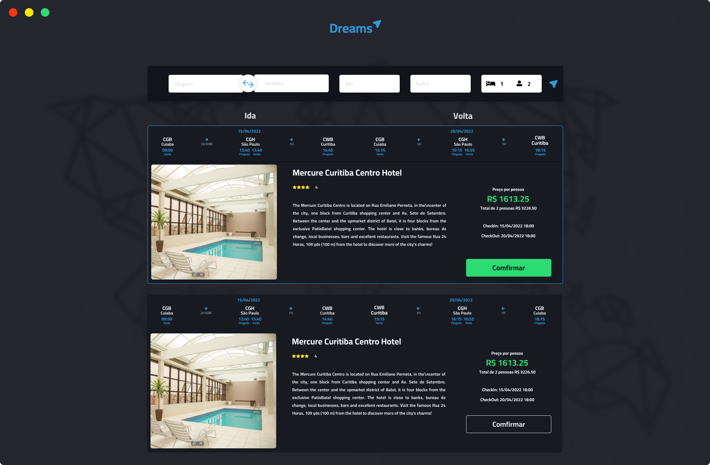

# Dreams

Dreams é um projeto academico, desenvolvido no intuido de testar a arquitetura de microsserviços. Este projeto é faz parte do meu Trabalho de Conclusão em Bacharelado em Sistemas de Informação pela Universidade Federal de Mato Grosso(Campos de Rondonópolis) atual Universidade Federal de Rondonópolis.
Este projeto está sendo baseado em:  
* "Microservices Patterns" de Chris Richardson; 
* "Monolith to Microservices" de Sam Newman;
* "Developing Microservices with Node.js" de David Gonzalez;
*  "Building Microservices" de Sam Newman;
*  "Dive Into Design Patterns" de Alexander Shvets; 

Para tetar a aplicabilidade será feito uso de algumas APIs como:
* Amadeus (Consulta de Voos e Hoteis)
* Stripe (Plataforma de pagamentos)
* Ethereum (nodemailer, serviço SMTP)

O frontend do projeto será desenvolvido em cima deste layout https://www.figma.com/file/6I7KCuu7ogojkidwAXxvJT/Dreams?node-id=214%3A2

